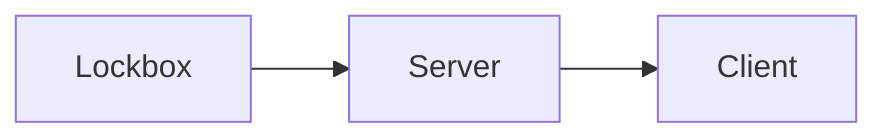

# Mercury Layer

Mercury Layer is a Layer 2 protocol for Bitcoin that enables the self-custodial transfer of coins (UTXOs) without on-chain transactions. 

This repository contains the server, client and lockbox implementations. The *lockbox* is a secure key manager that stores key shares and performs partial signatures. It supports multiple secure backends: filesystem (native), Google Cloud KMS, and HashiCorp Vault. The lockbox is connected to the server which exposes a public RESTful HTTP API, and connects to a Postgres database. The client is run by the user (as a stand alone app or a WASM component) that makes HTTP requests to the server API.  

# License

Mercury Layer is released under the terms of the GNU General Public License. See for more information https://opensource.org/licenses/GPL-3.0
